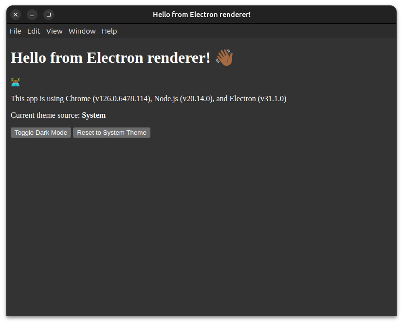
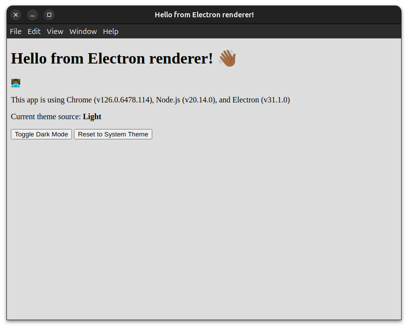
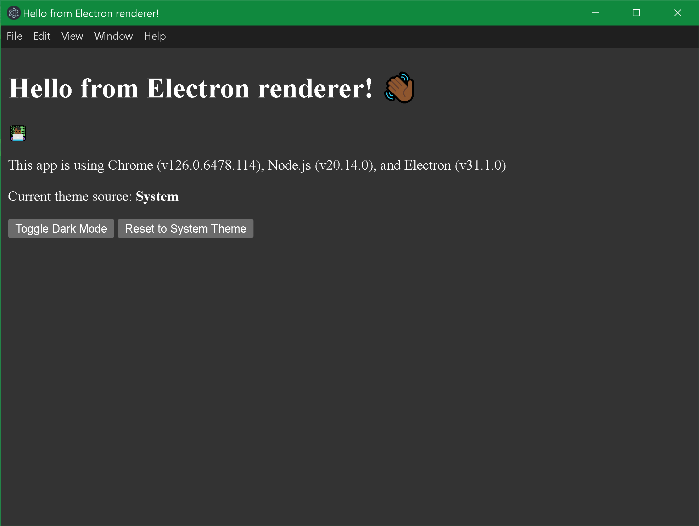
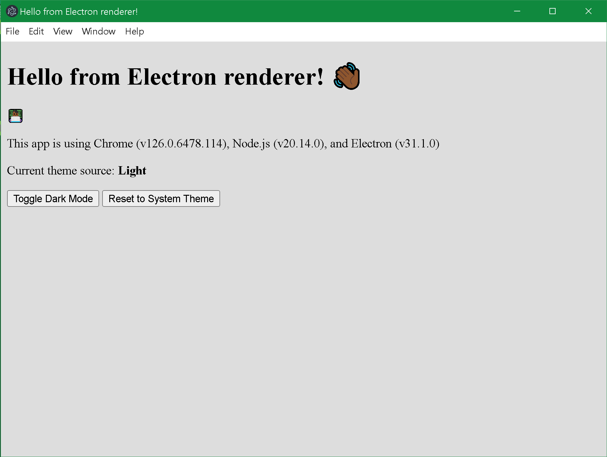

# Electron Publisher Test

Test of [Electron Publisher](https://www.electronjs.org/docs/latest/tutorial/tutorial-publishing-updating) for GitHub [here](https://github.com/hamilton-labs/Electron-Publisher).

## Description

Testing Electron Publisher environment workflows for GitHub.

## Getting Started

1. Head over to the [Releases](https://github.com/hamilton-labs/Electron-Publisher/releases) section.
2. Download the package relative to your system's architecture.
3. Run it in your sandbox/vm/container if you don't trust me. (You have options)

- ### On Debian/Ubuntu

  - [dpkg](https://www.dpkg.org/) - ``` dpkg install path/to/electron-tutorial_1.0.0_amd64.deb ```
  - [apt](https://ubuntu.com/server/docs/package-management) - ``` apt install path/to/electron-tutorial_1.0.0_amd64.deb ```
  - [gdebi](https://manpages.ubuntu.com/manpages/bionic/man1/gdebi.1.html) - ``` gdebi install path/to/electron-tutorial_1.0.0_amd64.deb ```

- ### On Redhat/Fedora

  - [dnf](https://docs.fedoraproject.org/en-US/quick-docs/dnf/) - ``` dnf install path/to/electron-tutorial-1.0.0-1.x86_64.rpm ```
  - [rpm](https://rpm-software-management.github.io/rpm/man/rpm.8.html) ``` rpm install path/to/electron-tutorial-1.0.0-1.x86_64.rpm ```

- ### On Windows 10/11

  - [NuGet](https://fileinfo.com/extension/nupkg) - ``` electron_tutorial-1.0.0-full.nupkg ```
  - [Explorer](https://support.microsoft.com/en-us/windows/find-and-open-file-explorer-ef370130-1cca-9dc5-e0df-2f7416fe1cb1#WindowsVersion=Windows_10) - ``` electron-tutorial-1.0.0 Setup.exe ```

### Dependencies

- (x86_64 --arch) Debian/Ubuntu for .deb file
- (x86_64 --arch) RedHat/Fedora for .rpm file
- (x86_64 --arch) Windows 10/11

### Screenshots

Linux 🐧


<p style="text-align: center; margin-left: auto; margin-right: auto;">System (Auto), Light, and Dark modes.</p>

Windows 🪟


<p style="text-align: center; margin-left: auto; margin-right: auto;">System (Auto), Light, and Dark modes.</p>

You know what's next... (Hint 🍏)
